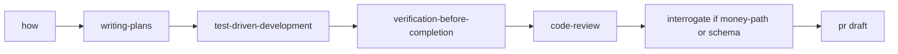

# Superstacks

Lean MIT skill stack for coding agents: discovery, plans, TDD, verification, review, draft PRs, and ticket pipelines.

Superstacks is a small plugin, not a giant catalog. It vendors a handful of upstream skills at pinned git SHAs, applies documented patches, and adds a generic ticket pipeline plus hard safety overrides. The GitHub repository name is `KunanonJ/superstacks`.

## Why this instead of raw upstream

- One folder you can list in Claude, Cursor, and Codex marketplaces.
- Descriptions stay short, trigger-first, and product-neutral in skill bodies.
- Safety overrides beat skill text: draft PRs, `Refs #N`, no merge, evidence before "done".
- Vendored copies are hashed in `sources.lock.json`. Patches live in `patches/`.

## Quick start

Pick one row. The owner will rename the GitHub repo to `superstacks`; use that name in the commands.

| Surface | How |
| --- | --- |
| Claude Code | `/plugin marketplace add KunanonJ/superstacks` then `/plugin install superstacks@superstacks` |
| Cursor | Copy `plugins/superstacks/` to `~/.cursor/plugins/local/superstacks/` until the public listing exists |
| Codex | `codex plugin marketplace add KunanonJ/superstacks` |
| claude.ai ZIP upload | `python scripts/build_zips.py` and upload a per-skill ZIP from `dist/` (`<skill>/SKILL.md` layout) |
| ChatGPT ZIP upload | Same per-skill ZIPs, or `dist/superstacks-plugin.zip` for the OpenAI plugin portal |
| `npx skills add` | `DISABLE_TELEMETRY=1 npx skills add KunanonJ/superstacks -g -s '*' --copy -y` |
| Plain copy | Copy `plugins/superstacks/skills/<name>/` into your agent's skills directory |

Attach `dist/` artifacts to a GitHub Release when you cut a version. This repo does not create the `v6.0.0` tag for you.

## What this plugin runs, sends or fetches

Nothing. Superstacks is markdown, a couple of static images, and text helpers. It does not start processes, open network connections, collect telemetry, or read credentials. Optional installers such as `npx skills add` are third-party; pass `DISABLE_TELEMETRY=1` if you use that path.

## Pipeline

`ticket-pipeline` is the user-invoked router for that order. `safety-overrides` always apply.

## Skills

| Skill | Invocation | Source |
| --- | --- | --- |
| writing-plans | model | obra/superpowers |
| test-driven-development | model | obra/superpowers |
| verification-before-completion | model | obra/superpowers |
| diagnosing-bugs | model | mattpocock/skills |
| code-review | model | mattpocock/skills |
| pr | model | mattpocock/skills |
| writing-for-agents | model | mattpocock/skills |
| grilling | model | mattpocock/skills |
| domain-modeling | model | mattpocock/skills |
| grill-with-docs | user | mattpocock/skills |
| how | user | pstack (cursor/plugins) |
| interrogate | user | pstack (cursor/plugins) |
| ticket-pipeline | user | this repo |
| workflow-profile | user | this repo |

Always-on rule: `plugins/superstacks/rules/safety-overrides.mdc`.

## Safety

- Draft pull requests only. Never merge, auto-merge, or mark ready.
- `Refs #N` never `Closes` / `Fixes` / `Resolves`.
- Push the working branch only. `--force-with-lease` only.
- No production credentials, live infrastructure, runtime installs, or secret CI jobs.
- Plans go in the PR body. "Done" needs pasted command output.

See [SECURITY.md](SECURITY.md).

## Contributing

See [CONTRIBUTING.md](CONTRIBUTING.md). Run `python -m app.plugin_lint` and `python -m pytest` before opening a draft PR.

## Credits

Vendored under MIT from Jesse Vincent, Matt Pocock, Lauren Tan / pstack, and a confirmed MIT excerpt of HumanLayer `show-me` inside `pr`. Full notices: [plugins/superstacks/THIRD_PARTY.md](plugins/superstacks/THIRD_PARTY.md).

## License

[MIT](LICENSE) © 2026 Kunanon Jarat.
